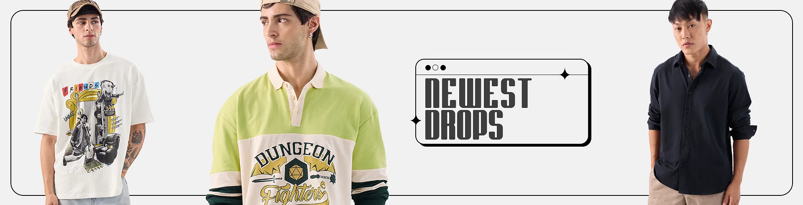
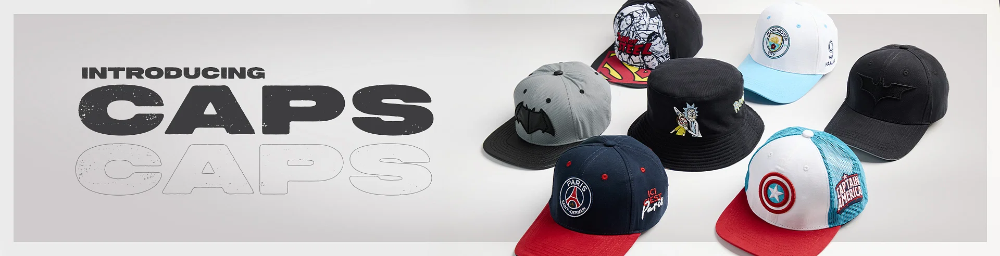
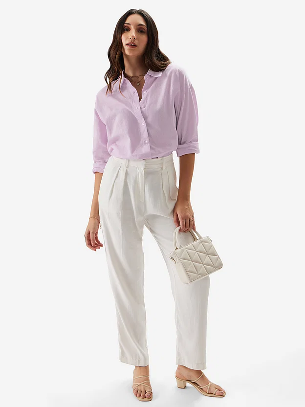
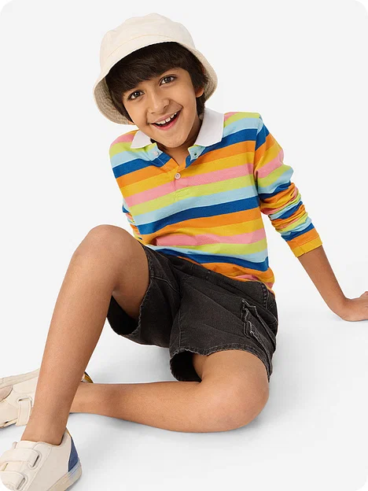
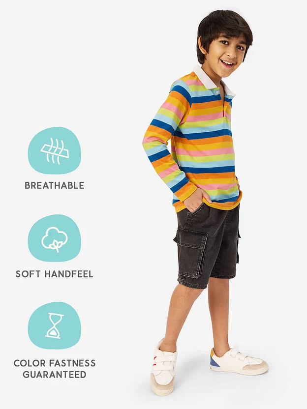

<!DOCTYPE html>
<html lang="en">
<head>
    <meta charset="UTF-8">
    <meta name="viewport" content="width=device-width, initial-scale=1.0">
    <title>Document</title>
    <link href="https://cdn.jsdelivr.net/npm/bootstrap@5.3.0/dist/css/bootstrap.min.css" rel="stylesheet">
    <link rel="stylesheet" href="style.css">
    
    
</head>
<body>
    <nav class="navbar navbar-expand-lg navbar-danger bg-danger px-3">
          

            
            <button class="navbar-toggler" type="button" data-bs-toggle="collapse" data-bs-target="#collapsibleNavId" aria-controls="collapsibleNavId"
                aria-expanded="false" aria-label="Toggle navigation">
                
            </button>
            

                <ul class="navbar-nav ms-auto mb-2 mb-lg-0">
                    <li class="nav-item">
                        <a class="nav-link active border-start border-2 ps-3" href="#" aria-current="page">Home </a>
                             <!-- (current)</a> -->
                    </li>
                    <li class="nav-item">
                        <a class="nav-link" href="https://www.thesouledstore.com/men">MEN</a>
                    </li>
                   <li class="nav-item">
                    <a class="nav-link" href="https://www.thesouledstore.com/women">WOMEN</a>
                   </li>
                   <li class="nav-item">
                    <a class="nav-link" href="https://www.thesouledstore.com/kids">KIDS</a>
                   </li>
                   
                </ul>
                <form class="d-flex my-2 my-lg-0">
                    <input class="form-control me-sm-2" type="text" placeholder="Search items">
                    <button class="btn btn-outline-light my-2 my-sm-0" type="submit">search</button>
                </form>
                     

                 

                </nav>

                <section class="home mt-3">
             

                

                    <button type="button" data-bs-target="#carouselId" data-bs-slide-to="0" class="active" aria-current="true" aria-label="First slide"></button>
                    <button type="button" data-bs-target="#carouselId" data-bs-slide-to="1" aria-label="Second slide"></button>
                    <button type="button" data-bs-target="#carouselId" data-bs-slide-to="2" aria-label="Third slide"></button>
                    <button type="button" data-bs-target="#carouselId" data-bs-slide-to="3" aria-label="Fourth slide slide"></button>
                    <button type="button" data-bs-target="#carouselId" data-bs-slide-to="4" aria-label="Fifth slide slide"></button>
                    <button type="button" data-bs-target="#carouselId" data-bs-slide-to="5" aria-label="Sixth slide slide"></button>
                    <button type="button" data-bs-target="#carouselId" data-bs-slide-to="6" aria-label="Seventh slide slide"></button>
                

                

                    

                        
                        

                            
                            
                          
                        

                    

                    

                        
                    

                    

                        
                    

                    

                        
                    

                    

                        
                    

                    

                        
                    

                    

                        
                    

                    
                

                <button class="carousel-control-prev" type="button" data-bs-target="#carouselId" data-bs-slide="prev">
                    
                    Previous
                </button>
                <button class="carousel-control-next" type="button" data-bs-target="#carouselId" data-bs-slide="next">
                    
                    Next
                </button>
             

             </section>
             <section class="features my-5">
                

                    

                        

                        
                        <h3>
                            Search online
                        </h3>
                        

                         Add to cart with one click.
                        

                     

                     
                        

                        
                        <h3>
                           Return policy
                        </h3>
                        

                            Your trust our responsibility.
                        

                     

                     
                      

                </section>

                <section class="Ready text-center py-5 text-warning">
                    <h1>
                        HOMEGROWN INDIAN BRAND.
                    </h1>
                    

                    OVER 6 MILLION HAPPY CUSTOMERS. 
                    

                    </section>
                    <section class="about my-5">
                        

                            

                            

                                <h3> One click Order</h3>
                                

                                    Order all the products online with one click and get it at your doorstep. avoid long ques and struggles . Do shopping from comfort of your door . 
                                

                                <a href="#" class="btn btn-outline-danger">About Us</a>
                            

                            

                                
                            

                        

                        

                    </section>
                    <section class="see py-5 my-5">
                        

                            

                                <!-- Button trigger modal -->

                                
                                <!-- Modal -->
                                

                                    

                                        

                                                

                                                        
                                                            <button type="button" class="btn-close" data-bs-dismiss="modal" aria-label="Close"></button>
                                                    

                                            

                                               <iframe src="https://youtu.be/c-_sjJDAjuM" title="youtube video player" frameborder="0" allow="accelerometer; autoplay;clipboard-write; encrypted-media; gyroscope; picture-in-picture" allowfullscreen></iframe>
                                            

                                           
                                        

                                    

                                

                                
                               
                                

                            

                        

                    </section>
                    <section class="gallery text-center">
                        

                            <h1 class="text-light"> Top selling</h1>
                            

                                
                            

                            

                                

                    

                        

                            <!-- Button trigger modal -->
                            <button type="button" class="btn text-white" data-bs-toggle="modal" data-bs-target="#exampleModal1">
                                
                                  </button>
                            
                                  <!-- Modal -->
                                  

                                    

                                      

                                        

                            
                                          <button type="button" class="btn-close" data-bs-dismiss="modal" aria-label="Close"></button>
                                        

                                        

                                          
                                         
                                        

                                        

                                            <button type="button" class="btn btn-secondary" data-bs-dismiss="modal">Close</button>
                                            <button type="button" class="btn btn-danger">ADD TO CART</button>
                                          

                            
                                      

                                    

                                  

                                

                            
                        

                            <!-- Button trigger modal -->
                            <button type="button" class="btn text-white" data-bs-toggle="modal" data-bs-target="#exampleModal2">
                                
                                  </button>
                            
                                  <!-- Modal -->
                                  

                                    

                                      

                                        

                            
                                          <button type="button" class="btn-close" data-bs-dismiss="modal" aria-label="Close"></button>
                                        

                                        

                                          
                            
                                        

                                        

                                            <button type="button" class="btn btn-secondary" data-bs-dismiss="modal">Close</button>
                                            <button type="button" class="btn btn-danger">ADD TO CART</button>
                                          

                            
                                      

                                    

                                  

                                

                                

                                    <!-- Button trigger modal -->
                                    <button type="button" class="btn text-white" data-bs-toggle="modal" data-bs-target="#exampleModal3">
                                        
                                          </button>
                                    
                                          <!-- Modal -->
                                          

                                            

                                              

                                                

                                    
                                                  <button type="button" class="btn-close" data-bs-dismiss="modal" aria-label="Close"></button>
                                                

                                                

                                                  
                                    
                                                

                                                

                                                    <button type="button" class="btn btn-secondary" data-bs-dismiss="modal">Close</button>
                                                    <button type="button" class="btn btn-danger">ADD TO CART</button>
                                                  

                                    
                                              

                                            

                                          

                                        

                                    
                                

                            

                    </section>
                    <section class="signup bg- text-white text-center py-5">
                        <section class="vh-100 gradient-custom">
                            

                              

                                

                                  

                                    

                                      <h3 class="mb-4 pb-2 pb-md-0 mb-md-5">Registration Form</h3>
                                      <form>
                          
                                        

                                          

                          
                                            

                                              <input type="text" id="firstName" class="form-control form-control-lg" />
                                              <label class="form-label" for="firstName">First Name</label>
                                            

                          
                                          

                                          

                          
                                            

                                              <input type="text" id="lastName" class="form-control form-control-lg" />
                                              <label class="form-label" for="lastName">Last Name</label>
                                            

                          
                                          

                                        

                          
                                        

                                          

                          
                                            

                                              <input type="text" class="form-control form-control-lg" id="birthdayDate" />
                                              <label for="birthdayDate" class="form-label">Birthday</label>
                                            

                          
                                          

                                          

                          
                                            <h6 class="mb-2 pb-1">Gender: </h6>
                          
                                            

                                              <input class="form-check-input" type="radio" name="inlineRadioOptions" id="femaleGender"
                                                value="option1" checked />
                                              <label class="form-check-label" for="femaleGender">Female</label>
                                            

                          
                                            

                                              <input class="form-check-input" type="radio" name="inlineRadioOptions" id="maleGender"
                                                value="option2" />
                                              <label class="form-check-label" for="maleGender">Male</label>
                                            

                          
                                            

                                              <input class="form-check-input" type="radio" name="inlineRadioOptions" id="otherGender"
                                                value="option3" />
                                              <label class="form-check-label" for="otherGender">Other</label>
                                            

                          
                                          

                                        

                          
                                        

                                          

                          
                                            

                                              <input type="email" id="emailAddress" class="form-control form-control-lg" />
                                              <label class="form-label" for="emailAddress">Email</label>
                                            

                          
                                          

                                          

                          
                                            

                                              <input type="tel" id="phoneNumber" class="form-control form-control-lg" />
                                              <label class="form-label " for="phoneNumber" >Phone Number</label>
                                            

                          
                                          

                                        

                          
                                        
                                        

                                          <input data-mdb-ripple-init class="btn btn- btn-outline-danger btn-lg" type="submit" value="Submit" />
                                        

                          
                                      </form>
                                    

                                  

                                

                              

                            

                          </section>
</section>
<footer style="background-color: rgb(245, 233, 233);" class="py-3 text-danger text-center">

    &copy; Thesouledstore

</footer>

    
</body>
</html>
